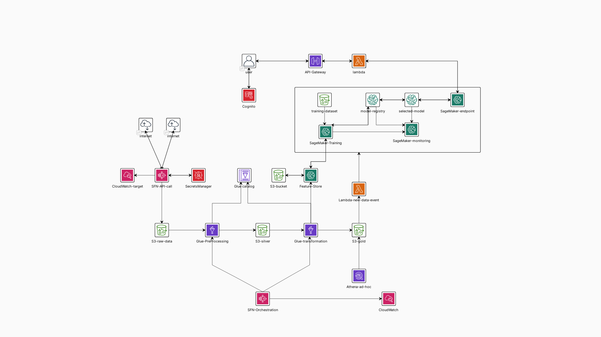

# Architecture

Example of a MLOps architecture on AWS using SageMaker, S3, Lambda, Step Functions, and CloudWatch.

## Resources used

Third-party API and API driven data pipeline
- https://aws.amazon.com/blogs/publicsector/unlock-third-party-data-api-driven-data-pipelines-aws/#orchestration

Data drift detection
- https://aws.amazon.com/blogs/architecture/detecting-data-drift-using-amazon-sagemaker/

Workflow example of datadrift:
- https://medium.com/@datalab_70093/end-to-end-mlops-on-aws-part3-1-time-series-forecasting-mlops-overview-and-simulation-99553558d3ba

Data catalog - explanation
https://learning.oreilly.com/library/view/data-engineering-with/9781804614426/Text/Chapter_05.xhtml#:-:text=As%20information%20is%20discovered,in%20the%20following%20diagram%3A

AWS Cognito and API Gateway
- https://awskarthik82.medium.com/part-1-securing-aws-api-gateway-using-aws-cognito-oauth2-scopes-410e7fb4a4c0

AWS Cognito:
- https://medium.com/@leocherian/amazon-api-gateway-with-cognito-user-pool-d752a36366c

Data ingestion with AWS Glue:
- https://learning.oreilly.com/library/view/serverless-etl-and/9781800564985/B16741_03_ePub.xhtml

# Solution explanation

## Data ingestion

